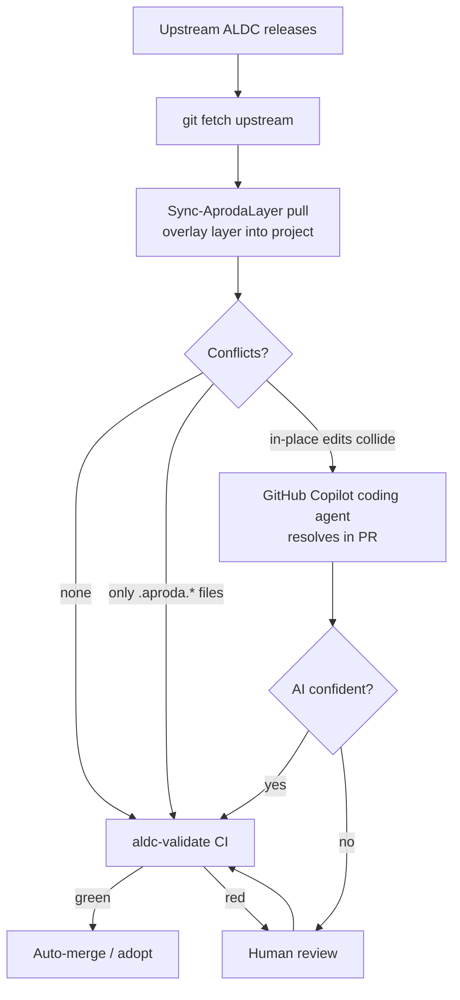

# Aproda ALDC Layer — README

> **Version:** `1.2.0+aproda.1` &nbsp;·&nbsp; **ALDC base:** `a900263` (in sync with upstream, 2026-06-25) — scheme `<ALDC core.version>+aproda.<n>` ([`decisions.aproda.md`](decisions.aproda.md) D-17).
> Aproda's customization layer on top of **ALDC** (AL Development Collection).
> Fork: <https://github.com/Aproda-AG/ALDC-AL-Development-Collection-Aproda>
> Upstream: ALDC Core (tracked via `upstream` remote).

This file (and its sibling [`decisions.aproda.md`](decisions.aproda.md)) document **how Aproda extends and maintains ALDC** so the context is never lost between sessions or contributors.

---

## TL;DR — the two rules

1. **Net-new things** (our own skills, agents, prompts, instructions) → live in the **same Upstream folders** with an **`.aproda.` infix** (files) or **`skill-aproda-*`** prefix (skill folders). They never collide with Upstream → the overlay syncer (D-18) always merges them cleanly.
2. **Changes to Upstream behaviour** → edit the **original file in place**. The resulting **conflict on the next Upstream merge is the signal** ("Upstream changed something I also touched — review it"). We deliberately accept conflicts as a change-log rather than hiding edits in a shadow layer.

There is **no separate `aproda/` override folder, no agent clones, and no `.vscode` discovery registration** — by design (see [`decisions.aproda.md`](decisions.aproda.md), D-3/D-4/D-5).

---

## Naming convention (net-new)

| Primitive | Upstream example | Aproda net-new | Why |
|-----------|------------------|----------------|-----|
| Prompt / Workflow | `prompts/al-build.prompt.md` | `prompts/al-build.aproda.prompt.md` | ends in `.prompt.md` → Default discovery still finds it; sorts next to original |
| Instruction | `instructions/al-events.instructions.md` | `instructions/al-deploy.aproda.instructions.md` | ends in `.instructions.md` → `applyTo` glob still fires |
| Agent | `agents/al-developer.agent.md` | `agents/aproda-test-runner.aproda.agent.md` | ends in `.agent.md` → discoverable; `@`-callable |
| Skill (new) | `skills/skill-testing/` | `skills/skill-aproda-test-loop/` | folder namespace; agents read it by path |
| Skill (extend existing) | — | `skills/skill-testing/aproda-extra-patterns.md` | new file in existing folder merges conflict-free |

**Key property:** the `.aproda.` infix keeps the **type suffix intact** (`.prompt.md`, `.instructions.md`, `.agent.md`), so VS Code's default discovery and `applyTo` matching keep working **without any `.vscode/settings.json` registration**.

---

## What lives here (Aproda layer inventory = the index)

This table **is** the Aproda index (D-17) — the one place to answer "what has Aproda added?". Keep it current. Net-new items never conflict on an Upstream merge; in-place edits are the deliberate merge-points in the [Upstream edits register](decisions.aproda.md).

### Net-new artifacts (`.aproda.` / `skill-aproda-*` — conflict-free)

| Item | Path | Decision | Status |
|------|------|----------|--------|
| This README (= the inventory/index) | `.github/readme.aproda.md` | D-1 | live |
| Design decisions | `.github/decisions.aproda.md` | D-1 | live (D-1…D-18) |
| Site profile (infra facts) | `.github/site-profile.aproda.md` | D-16 | live |
| Test-loop skill | `.github/skills/skill-aproda-test-loop/` | D-8, D-15 | **VALIDATED** (27/27 green) |
| Meta-skill (explain + extend the layer) | `.github/skills/skill-aproda-aldc/` | D-16 | live |
| Steward guardrail (HITL on layer edits) | `.github/instructions/aproda-aldc-steward.aproda.instructions.md` | D-16 | live |
| UAT-loop instruction | `.github/instructions/uat-loop.aproda.instructions.md` | D-11 | live |
| Doc-update workflow | `.github/prompts/al-doc-update.aproda.prompt.md` | D-14 | live |
| Layer sync (allowlist manifest + overlay script) | `.github/tools/aproda-sync/` | D-18 | live |

### In-place Upstream edits (deliberate merge-points)

Exact diffs in the [Upstream edits register](decisions.aproda.md).

| File | Why | Decision |
|------|-----|----------|
| `copilot-instructions.md` | Skills-table rows for the 2 Aproda skills + v1.1→v1.2 drift-fix | D-7 / D-16 / D-17 |
| `agents/al-developer.agent.md` | Test-loop + `al-doc-update` wiring (LOW trigger) | D-9 / D-14 |
| `agents/al-conductor.agent.md` | Test-loop gate + `al-doc-update` row (MEDIUM/HIGH) | D-9 / D-14 |
| `tools/aldc-validate/index.js` | v1.1→v1.2 banner drift-fix | D-17 |

### Personal fallback (not synced)

| Item | Path | Decision |
|------|------|----------|
| Condensed infra facts (cross-workspace user memory) | `/memories/aproda-infra.md` | D-16 |

> Keep this table current — it is the one place to answer "what has Aproda added?".

---

## Upgrade cycle (ALDC → Aproda fork)

Goal: pull Upstream improvements with **as much automation as possible**, human only on real conflicts.

**Why this works:** `.aproda.` files **never** conflict (Upstream doesn't create them), so the conflict set is **only** our deliberate in-place edits — small, predictable, and exactly the changes that deserve a review. See [`decisions.aproda.md`](decisions.aproda.md) D-6.

### Pinning

The ALDC base is **pinned** in `aldc.yaml → aproda.basePin` (analogous to the BCQuality SHA pin in `aldc.yaml → external.bcquality`) so upgrades are intentional and reproducible. Current pin: `a900263f51e416762cc7f85575deb9b30cd5b1e3` (upstream == fork, in sync 2026-06-25). On each adopted upgrade, bump `aproda.layerVersion` and add a row to the [Version / pin changelog](decisions.aproda.md). Scheme: `<ALDC core.version>+aproda.<n>` (D-17).

---

## Distribution — how the layer ships (D-18)

The layer is **not** distributed by `git subtree`. A project's `.github/` has **three owners** — AL-Go (`workflows/*`, `.AL-Go/`, `AL-Go-Settings.json`), the Aproda toolkit (this layer), and the project itself (`plans/`, `documentation/`, the app) — and subtree treats the whole tree as one unit, so it would clobber the other two owners. Instead, a small **allowlist-driven overlay syncer** moves only layer files in and out:

| Piece | Path | Role |
|-------|------|------|
| Manifest | [`tools/aproda-sync/aproda-sync.json`](tools/aproda-sync/aproda-sync.json) | the allowlist (convention globs + named net-new files + `inPlaceEdits` + ALDC framework) and the `layouts` block |
| Syncer | [`tools/aproda-sync/Sync-AprodaLayer.ps1`](tools/aproda-sync/Sync-AprodaLayer.ps1) | `-Direction pull\|push`, overlay-copy, `-WhatIf`, SRP-safe (cmdlet-only) |

**Asymmetric layout.** The **fork** stores toolkit primitives at **repo root** (`agents/`, `skills/`, `instructions/`, `prompts/`, `docs/`, `tools/`) with only `copilot-instructions.md`, `plans/` and our `*.aproda.md` under its own `.github/`; a **consuming project** stores the *whole* toolkit under `.github/`. The syncer maps every file through a **logical path** (project-layout, relative to `.github/`) and remaps Root↔`.github/` per side via the manifest `layouts` block (`fork.base="."` + a `dotGithub` exception list; `project.base=".github"`). So `agents/x.md` ↔ fork-root `agents/x.md` but project `.github/agents/x.md`, while `copilot-instructions.md` / `*.aproda.md` stay under `.github/` on both ends.

**Two directions, two owners untouched:**

- **pull** (fork → project): overlay the layer into `.github/`; AL-Go and project files are never on the allowlist, so they survive untouched.
- **push** (project → fork): stage **only** layer files for a fork PR; `plans/`/`documentation/` physically can't reach the fork because they aren't listed (plus a `neverTouch` tripwire as belt-and-suspenders).

`aldc.yaml` is a **dual-variant** file (D-18): it sits at the repo root on both sides but its `toolkitRoot` line must diverge (`".github"` in a project, `"."` in the fork), so the syncer copies it and rewrites that one line to the destination side's value (manifest `dualVariant`) — fully auto-synced, no manual upkeep. **Provenance:** the Root↔`.github/` remap + overlay semantics were distilled from the published ALDC VS Code extension 4.2.0 (`extension.js → installToolkit()`) and **re-implemented in PowerShell as manifest data — no JavaScript adopted or executed** (D-18). The extension's bundled `templates/` is effectively an offline snapshot of Upstream 4.2.0 (== `basePin a900263`), so it can also serve as an offline seed.

---

## Upstream touch-points (kept minimal)

We touch Upstream files in-place only where additive discovery requires it — currently **three** behaviour files plus a cosmetic drift-fix: `copilot-instructions.md` (Skills-table rows so Aproda skills show in routing) and the two agents `al-developer` / `al-conductor` (wiring the test-loop + `al-doc-update` triggers); the `aldc-validate` banner was corrected for the v1.2 drift. Each is a *deliberate* merge-point — the full list with exact diffs is the [Upstream edits register](decisions.aproda.md). Everything else is net-new `.aproda.` / `skill-aproda-*` and never conflicts.

---

## See also

- [`decisions.aproda.md`](decisions.aproda.md) — the **why** behind this structure (full decision record D-1…D-18).
- [`site-profile.aproda.md`](site-profile.aproda.md) — concrete infrastructure facts (K:, NST servers, SRP, remote-PS).
- [`skills/skill-aproda-aldc/SKILL.md`](skills/skill-aproda-aldc/SKILL.md) — meta-skill: explain & extend this layer.
- [`skills/skill-aproda-test-loop/SKILL.md`](skills/skill-aproda-test-loop/SKILL.md) — OnPrem test-loop (VALIDATED, 27/27).
