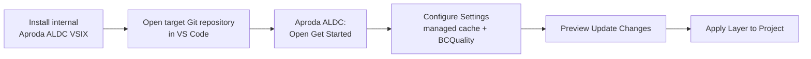
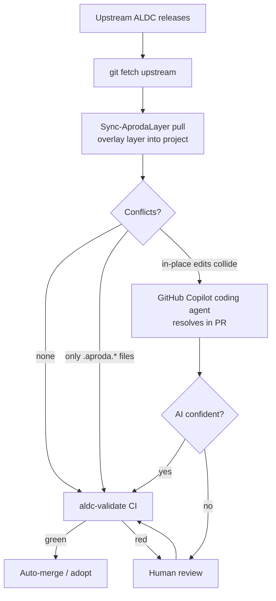

# Aproda ALDC Layer — README

> **Version:** `1.2.0_aproda.11` &nbsp;·&nbsp; **ALDC base:** `a900263` (in sync with upstream, 2026-06-25) &nbsp;·&nbsp; **Release:** CI-gated — scheme `<ALDC core.version>_aproda.<n>` ([`decisions.aproda.md`](decisions.aproda.md) D-17, D-25).
> Aproda's customization layer on top of **ALDC** (AL Development Collection).
> Fork: <https://github.com/Aproda-AG/ALDC-AL-Development-Collection-Aproda>
> Upstream: ALDC Core (tracked via `upstream` remote).

This file (and its sibling [`decisions.aproda.md`](decisions.aproda.md)) document **how Aproda extends and maintains ALDC** so the context is never lost between sessions or contributors.

---

## Features

What the Aproda layer adds on top of upstream ALDC:

| Feature | Description |
|---------|-------------|
| **ADO work item integration** | `skill-aproda-ado` — maps ADO work items (Bug/Task/US/Feature) to `req_name`, plans folder, and document headers; URL-based linking, no API fetch |
| **Deploy-Run-Verify Cycle** | `skill-aproda-deploy-run-verify` — publish → sync → deploy → run → review cycle for on-premises BC instances (VALIDATED, 27/27 green) |
| **HITL Validation instruction** | Auto-applied guardrail that wires the Deploy-Run-Verify Cycle into the HITL Validation phase |
| **Layer meta-skill** | `skill-aproda-aldc` — explains and extends the Aproda customization layer itself; entry to `site-profile.aproda.md` |
| **Steward guardrail** | HITL instruction that triggers on any proposed layer edit — all changes require explicit confirmation |
| **Doc-update workflow** | `/al-doc-update` — updates living documentation after implementation; integrated into `al-developer` and `al-conductor` |
| **VS Code extension** | `tools/aproda-vscode-extension/` — guided in-workspace initialization, managed layer cache, BCQuality setup, validation, and internal VSIX updates |
| **Release skill** | `skills/skill-aproda-aldc-release/` — fork-maintainer-only release governance for the layer and internal VSIX |
| **Overlay sync tool** | `tools/aproda-sync/` — allowlist-driven syncer to push/pull the layer between fork and projects (`Start-InitNewProject`, `Start-Pull`, `Start-Push`) |
| **Site profile** | `.github/site-profile.aproda.md` — concrete infrastructure facts (K: drive, NST servers, SRP, remote-PS) |

---

## Install via VS Code extension (Recommended)

> [!IMPORTANT]
> - ⚠️ (Noch) nicht kompatibel mit ACT (Aproda Copilot Template) von Antionio. **Nicht getestet und nicht empfohlen, beides gleichzeitig in einem Repo zu verwenden**



The internal **Aproda ALDC** extension is the standard path for initializing and updating an open project repository. It owns a managed local cache of this fork, so project developers do not clone the fork themselves.

1. Install the internal VSIX as described in [the extension README](../tools/aproda-vscode-extension/README.md#internal-installation).
2. Open the target Git repository in VS Code.
3. On first activation, select **Getting Started** in the notification, then run **Configure Settings** in the native walkthrough.
4. Run **Preview Update Changes** and review the result. Run **Apply Layer to Project** only after confirming the preview.
5. Run **Install / Update BCQuality** when the walkthrough reaches that step. The wizard proposes a shared, standalone `BCQuality-Aproda` location outside project repositories.
6. Use **Validate Installation** after applying the layer. For later changes, use **Check for Updates** and **Check for Extension Updates**.

## Fallback: Install via PowerShell initialization outside an open workspace

Use this path only when the target repository cannot be opened in VS Code, or when an administrator needs the external repository-picker workflow. It requires a local clone of this fork.

1. Clone the fork once: `git clone https://github.com/Aproda-AG/ALDC-AL-Development-Collection-Aproda`.
2. Open `tools/aproda-sync/Start-InitNewProject-SRP-Safe.ps1` from the fork.
3. Select all content and run it with **PowerShell: Run Selection** in the PowerShell Extension terminal.
4. Select or enter the target repository path. To bypass the selector, pre-fill `$targetRepo` in the launcher.

The launcher writes the layer to `.github/` and materializes `Start-Pull.ps1` for later updates. Both the extension and PowerShell paths use the same allowlist-driven sync engine and never delete project files.

### What initialization changes and what to commit

The bootstrap performs an initial layer pull, a second framework settle-pull, and the project-local initialization. The initialization is idempotent, so it also runs safely after every later pull.

Commit the project configuration and persistent working documents created or maintained by the initialization:

- `aldc.code-workspace`, created when absent, with `.github`, `App`, `Test`, and `../bcquality-aproda` roots. Rename or remove the `App` and `Test` placeholders to match the repository layout before committing.
- The workspace setting `chat.useCustomizationsInParentRepositories: true`; existing parseable workspace files are supplemented with the `.github` and BCQuality roots and this setting.
- `.github/plans/memory.md`, seeded once, and the requirement-specific planning documents beneath `.github/plans/`.
- Project-specific documentation and the root `.gitignore` update.

The root `.gitignore` gets one managed, clearly visible block: `# Aproda ALDC Tool - BEGIN/END`. Future init or pull runs update only this block. It ignores machine- or runtime-local material, notably:

- `.github/tools/aproda-sync/Start-Pull.ps1` and `Start-Push.ps1`, because they contain a workstation-specific absolute path to the fork.
- Temporary PowerShell execution folders: `**/PowerShell/_temp/` and `**/PowerShell/_runner/`.
- The synchronized Aproda/ALDC toolkit folders, preventing their distribution copy from being versioned independently in every consuming project. Project-specific skills can still be added alongside the ignored framework folders.

The syncer is an allowlist-only overlay: it copies the toolkit layer but never deletes files. Application code, AL-Go files, plans, and documentation are excluded from the sync and cannot be pushed from a project back to the fork.

### BCQuality knowledge base (one-time, per workstation)

**[BCQuality](https://github.com/microsoft/BCQuality)** is the official, agent-readable MS BC knowledge base for BC Development. `@Dredd` and the Review Subagent can use it during code review. It is mounted as a second workspace root (read-only) and never compiled into the AL extension.

BCQuality defines three layers: **MS** (official Microsoft guidelines), **Community** (supplementary patterns), and **Custom** (company-specific rules). The Aproda fork [`Aproda-AG/BCQuality-Aproda`](https://github.com/Aproda-AG/BCQuality-Aproda) populates the Custom layer with initial Aproda-specific additions.

The extension manages the recommended central clone at the configured developer root and reconciles project workspace files automatically. For the PowerShell fallback, clone it once alongside projects at `../bcquality-aproda`:

```
git clone https://github.com/Aproda-AG/BCQuality-Aproda bcquality-aproda
```

The folder must sit **next to** (not inside) the project repo so its `.al` files never enter the AL compiler's scope. Once cloned, it is available to all projects on the same workstation — no per-project setup needed. 

### PowerShell fallback — target repo not in the selection list

The script scans sibling folders of the fork for git repos. If the target project isn't found there (different drive, nested path, etc.):

**Option A — type the path at the console prompt** (no file edit needed):
When the grid is empty or you cancel/close it, the terminal falls back to a `Read-Host` prompt. Type the full path to the target repo and press Enter.

**Option B — pre-fill `$targetRepo` in the launcher** (line 9) and re-run:
```powershell
$targetRepo = 'C:\MyWorkspace\MyNewProject'
```
The selection dialog is skipped entirely.

---

## Aproda process extensions

### ADO work item integration (in work ⚠️)

Requirements, bugs, and tasks are tracked in Azure DevOps and flow directly into the ALDC planning structure via `skill-aproda-ado`:

- **Type-ID-short-name pattern** — the `req_name` (plans folder name) is derived as `{type}-{id}-{short-name}` (e.g. `bug-36370-posting-error`). The short name is derived from the work item title in kebab-case, with up to four or five meaningful words.
- **ADO header** — every plan document gets an `**ADO**: [Bug 36370](…)` link at the top so context is never lost.
- **Process** — the agent reads the work item description/acceptance criteria from the chat prompt (no API fetch). The planner creates `.github/plans/{type}-{id}-{short-name}/` with spec, architecture, and test-plan files using the ADO ID as the anchor throughout.

**How to start:**

   > **Tip:** You can also attach a technical specification document to the chat prompt — the agent will incorporate it when generating the plan.
   > ⚠️ **Planned:** direct ADO read-out (likely via ADO MCP) will eliminate the manual copy step in a future version.

1. **Review the work item in ADO** — check title, description, and acceptance criteria. Add technical details, edge cases, or test scenarios directly in ADO if they are missing. The richer the work item, the better the generated spec.
2. **Copy the work item URL and the relevant content into the chat prompt** — the agent cannot fetch ADO directly (no auth), so paste both:
   - the work item URL (used for `req_name` derivation and the ADO header link):
     ```
     https://dev.azure.com/alphasol/GustavGerigAG/_workitems/edit/36370
     ```
   - the work item content: title, description, acceptance criteria — everything the agent should use as the spec seed.

   Hand it to the appropriate agent (`@al-architect` for MEDIUM/HIGH complexity, or start with `/al-spec.create` for LOW). The agent confirms the derived `req_name` before creating any files.


See `skill-aproda-ado` for the full naming and URL construction rules (`org = alphasol`, project from `aldc.yaml → ado.project`).

---

### Deploy-Run-Verify Cycle

The Deploy-Run-Verify Cycle (`skill-aproda-deploy-run-verify`) is the technical CI surrogate for on-premises BC: it runs a full **deploy → run-tests → review → optimize** cycle against a live NST instance after every implementation increment.

- Publishes the `.app` to the target NST, syncs and installs it, then executes the AL test suite.
- On failure: surfaces the exact error with AL stack trace, feeds it back to the implementation agent for a fix, then re-runs — loop until green (`@al-developer` for direct implementation, `@al-conductor` for orchestrated TDD cycles).
- On success: the app stays deployed in the **ASINST environment** and is immediately available for manual testing.

This loop is wired into both `al-developer` and `al-conductor` as a pre-PR gate.

---

### HITL Validation

After the Deploy-Run-Verify Cycle is green, the feature moves to **HITL Validation** — human verification against real business scenarios, either in the **ASINST environment** (the most recent app build is already deployed there from the Deploy-Run-Verify Cycle and ready to test immediately) or in a customer development environment.

**When HITL Validation feedback arrives:**

Negative test results or user feedback are collected and handed to the implementation agent (`@al-developer` for direct fixes, `@al-conductor` for orchestrated TDD cycles) either as:
- a Markdown file with issue descriptions, or
- a direct chat prompt describing what failed.

The agent creates or updates a `{req_name}-hitl-validation-issues.md` file in `.github/plans/{req_name}/`. Each issue gets a global, monotonic ID (`I-1`, `I-2`, …) and a `Status` field (`TODO` / `DONE`). The agent works through open issues one at a time (Status = TODO), runs the Deploy-Run-Verify Cycle after each fix, and marks the issue `DONE`. Multiple feedback rounds append a new `## Loop N` section — the file is never split.

**The `hitl-validation.aproda.instructions.md` instruction** governs this contract: the spec is the target-state reference, not a checklist — only `hitl-validation-issues.md` status fields drive what is still to do.

**When HITL Validation is successful:**

Run `/al-pr-prepare` (see next section). This closes the current HITL Validation and the entire plan folder for this requirement. Any further changes or fixes — even small follow-ups — start as a **new** `.github/plans/{new-req-name}/` folder.

---

### PR preparation — living documentation

When running `/al-pr-prepare` (or the equivalent conductor phase), two documentation artifacts are **created or updated** as part of every PR:

| Artifact | What it contains |
|----------|-----------------|
| **Module Requirement** (technical documentation) | Complete specification of the entire module in its current state — object model, business logic, integration points, permissions. Not a delta; always the full picture. |
| **Handbuch DE-CH** (user manual) | End-user guide for the whole module in Swiss German, updated to reflect the current feature set. Again a full-module view, not a change log. |

Both artifacts live in the project's `documentation/` folder and are committed together with the code changes in the PR. This ensures that documentation is never left behind and always matches what is deployed.

---

## TL;DR — Extend Aproda ALDC — the two rules

1. **Net-new things** (our own skills, agents, prompts, instructions) → live in the **same Upstream folders** with an **`.aproda.` infix** (files) or **`skill-aproda-*`** prefix (skill folders). They never collide with Upstream → the overlay syncer (D-18) always merges them cleanly.
2. **Changes to Upstream behaviour** → edit the **original file in place**. The resulting **conflict on the next Upstream merge is the signal** ("Upstream changed something I also touched — review it"). We deliberately accept conflicts as a change-log rather than hiding edits in a shadow layer.

There is **no separate `aproda/` override folder, no agent clones, and no `.vscode` discovery registration** — by design (see [`decisions.aproda.md`](decisions.aproda.md), D-3/D-4/D-5).

---

## Naming convention (net-new)

| Primitive | Upstream example | Aproda net-new | Why |
|-----------|------------------|----------------|-----|
| Prompt / Workflow | `prompts/al-build.prompt.md` | `prompts/al-build.aproda.prompt.md` | ends in `.prompt.md` → Default discovery still finds it; sorts next to original |
| Instruction | `instructions/al-events.instructions.md` | `instructions/al-deploy.aproda.instructions.md` | ends in `.instructions.md` → `applyTo` glob still fires |
| Agent | `agents/al-developer.agent.md` | `agents/aproda-test-runner.aproda.agent.md` | ends in `.agent.md` → discoverable; `@`-callable |
| Skill (new) | `skills/skill-testing/` | `skills/skill-aproda-deploy-run-verify/` | folder namespace; agents read it by path |
| Skill (extend existing) | — | `skills/skill-testing/aproda-extra-patterns.md` | new file in existing folder merges conflict-free |

**Key property:** the `.aproda.` infix keeps the **type suffix intact** (`.prompt.md`, `.instructions.md`, `.agent.md`), so VS Code's default discovery and `applyTo` matching keep working **without any `.vscode/settings.json` registration**.

---

## What lives here (Aproda layer inventory = the index)

This table **is** the Aproda index (D-17) — the one place to answer "what has Aproda added?". Keep it current. Net-new items never conflict on an Upstream merge; in-place edits are the deliberate merge-points in the [Upstream edits register](decisions.aproda.md).

### Net-new artifacts (`.aproda.` / `skill-aproda-*` — conflict-free)

| Item | Path | Decision | Status |
|------|------|----------|--------|
| This README (= the inventory/index) | `.github/readme.aproda.md` | D-1 | live |
| Design decisions | `.github/decisions.aproda.md` | D-1 | live (D-1…D-25) |
| Site profile (infra facts) | `.github/site-profile.aproda.md` | D-16 | live |
| Deploy-Run-Verify Cycle skill | `.github/skills/skill-aproda-deploy-run-verify/` | D-8, D-15 | **VALIDATED** (27/27 green) |
| Meta-skill (explain + extend the layer) | `.github/skills/skill-aproda-aldc/` | D-16 | live |
| Steward guardrail (HITL on layer edits) | `.github/instructions/aproda-aldc-steward.aproda.instructions.md` | D-16 | live |
| HITL Validation instruction | `.github/instructions/hitl-validation.aproda.instructions.md` | D-11 | live |
| Doc-update workflow | `.github/prompts/al-doc-update.aproda.prompt.md` | D-14 | live |
| Layer sync (allowlist manifest + overlay script) | `.github/tools/aproda-sync/` | D-18 | live |
| Fleet management tools (fork-only: status / update / gather) | `tools/aproda-sync/fleet/` | D-21 | live |
| VS Code extension (fork-only: guided project setup and updates) | `tools/aproda-vscode-extension/` | D-21 | live |
| Release skill (fork-only: tag and GitHub Release governance) | `skills/skill-aproda-aldc-release/` | D-25 | live |

### In-place Upstream edits (deliberate merge-points)

Exact diffs in the [Upstream edits register](decisions.aproda.md).

| File | Why | Decision |
|------|-----|----------|
| `copilot-instructions.md` | Skills-table rows for the 2 Aproda skills + v1.1→v1.2 drift-fix | D-7 / D-16 / D-17 |
| `agents/al-architect.agent.md` | CANNOT block corrected (read-only terminal/subagent allowed for context-gathering); duplicate tool removed | D-2 |
| `agents/al-developer.agent.md` | Deploy-Run-Verify Cycle + `al-doc-update` wiring; SShadowSdk casing + context7 MCP name fix | D-9 / D-14 / D-2 |
| `agents/al-conductor.agent.md` | Deploy-Run-Verify Cycle gate + `al-doc-update` row (MEDIUM/HIGH) | D-9 / D-14 |
| `agents/al-implement-subagent.agent.md` | SShadowSdk publisher casing fix | D-2 |
| `agents/al-agent-builder.agent.md` | SShadowSdk casing + context7 MCP name fix | D-2 |
| `agents/al-presales.agent.md` | context7 MCP name fix | D-2 |
| `tools/aldc-validate/index.js` | v1.1→v1.2 banner drift-fix | D-17 |

### Personal fallback (not synced)

| Item | Path | Decision |
|------|------|----------|
| Condensed infra facts (cross-workspace user memory) | `/memories/aproda-infra.md` | D-16 |

> Keep this table current — it is the one place to answer "what has Aproda added?".

---

## Extension Ideas

Open, fork-internal enhancement proposals are tracked in
[`extension-ideas.md`](extension-ideas.md). An approved item moves to a dedicated
plan folder; adopted architectural decisions are recorded in
[`decisions.aproda.md`](decisions.aproda.md).

---

## Upgrade cycle (ALDC → Aproda fork)

Goal: pull Upstream improvements with **as much automation as possible**, human only on real conflicts.



**Why this works:** `.aproda.` files **never** conflict (Upstream doesn't create them), so the conflict set is **only** our deliberate in-place edits — small, predictable, and exactly the changes that deserve a review. See [`decisions.aproda.md`](decisions.aproda.md) D-6.

### Pinning

The ALDC base is **pinned** in `aldc.yaml → aproda.basePin` (analogous to the BCQuality SHA pin in `aldc.yaml → external.bcquality`) so upgrades are intentional and reproducible. Current pin: `a900263f51e416762cc7f85575deb9b30cd5b1e3` (upstream == fork, in sync 2026-06-25). On each adopted upgrade, bump `aproda.layerVersion` and add a row to the [Version / pin changelog](decisions.aproda.md). Scheme: `<ALDC core.version>_aproda.<n>` (D-17).

On every version bump (Upstream upgrade **or** Aproda-layer change), merge the validated candidate to `aproda`. The layer release workflow validates it, waits for the `aproda-layer-release` Environment approval, then creates the matching Git tag and GitHub Release. Do not create or push the tag manually. The tag name matches the composite version string exactly; this makes the exact fork state reproducible and lets projects record which layer version they pulled.

---

## Distribution — how the layer ships (D-18)

The layer is **not** distributed by `git subtree`. A project's `.github/` has **three owners** — AL-Go (`workflows/*`, `.AL-Go/`, `AL-Go-Settings.json`), the Aproda toolkit (this layer), and the project itself (`plans/`, `documentation/`, the app) — and subtree treats the whole tree as one unit, so it would clobber the other two owners. Instead, a small **allowlist-driven overlay syncer** moves only layer files in and out:

| Piece | Path | Role |
|-------|------|------|
| Manifest | [`tools/aproda-sync/aproda-sync.json`](tools/aproda-sync/aproda-sync.json) | the allowlist (convention globs + named net-new files + `inPlaceEdits` + ALDC framework) and the `layouts` block |
| Syncer | [`tools/aproda-sync/Sync-AprodaLayer.ps1`](tools/aproda-sync/Sync-AprodaLayer.ps1) | `-Direction pull\|push`, overlay-copy, `-WhatIf`, SRP-safe (cmdlet-only) |

**Asymmetric layout.** The **fork** stores toolkit primitives at **repo root** (`agents/`, `skills/`, `instructions/`, `prompts/`, `docs/`, `tools/`) with only `copilot-instructions.md`, `plans/` and our `*.aproda.md` under its own `.github/`; a **consuming project** stores the *whole* toolkit under `.github/`. The syncer maps every file through a **logical path** (project-layout, relative to `.github/`) and remaps Root↔`.github/` per side via the manifest `layouts` block (`fork.base="."` + a `dotGithub` exception list; `project.base=".github"`). So `agents/x.md` ↔ fork-root `agents/x.md` but project `.github/agents/x.md`, while `copilot-instructions.md` / `*.aproda.md` stay under `.github/` on both ends.

**Two directions, two owners untouched:**

- **pull** (fork → project): overlay the layer into `.github/`; AL-Go and project files are never on the allowlist, so they survive untouched.
- **push** (project → fork): stage **only** layer files for a fork PR; `plans/`/`documentation/` physically can't reach the fork because they aren't listed (plus a `neverTouch` tripwire as belt-and-suspenders).

`aldc.yaml` is a **dual-variant** file (D-18): it sits at the repo root on both sides but its `toolkitRoot` line must diverge (`".github"` in a project, `"."` in the fork), so the syncer copies it and rewrites that one line to the destination side's value (manifest `dualVariant`) — fully auto-synced, no manual upkeep. **Provenance:** the Root↔`.github/` remap + overlay semantics were distilled from the published ALDC VS Code extension 4.2.0 (`extension.js → installToolkit()`) and **re-implemented in PowerShell as manifest data — no JavaScript adopted or executed** (D-18). The extension's bundled `templates/` is effectively an offline snapshot of Upstream 4.2.0 (== `basePin a900263`), so it can also serve as an offline seed.

---

## Upstream touch-points (kept minimal)

We touch Upstream files in-place only where additive discovery requires it — currently **three** behaviour files plus a cosmetic drift-fix: `copilot-instructions.md` (Skills-table rows so Aproda skills show in routing) and the two agents `al-developer` / `al-conductor` (wiring the Deploy-Run-Verify Cycle + `al-doc-update` triggers); the `aldc-validate` banner was corrected for the v1.2 drift. Each is a *deliberate* merge-point — the full list with exact diffs is the [Upstream edits register](decisions.aproda.md). Everything else is net-new `.aproda.` / `skill-aproda-*` and never conflicts.

---

## See also

- [`decisions.aproda.md`](decisions.aproda.md) — the **why** behind this structure (full decision record D-1…D-22).
- [`site-profile.aproda.md`](site-profile.aproda.md) — concrete infrastructure facts (K:, NST servers, SRP, remote-PS).
- [`skills/skill-aproda-aldc/SKILL.md`](skills/skill-aproda-aldc/SKILL.md) — meta-skill: explain & extend this layer.
- [`skills/skill-aproda-deploy-run-verify/SKILL.md`](skills/skill-aproda-deploy-run-verify/SKILL.md) — Deploy-Run-Verify Cycle (VALIDATED, 27/27).
