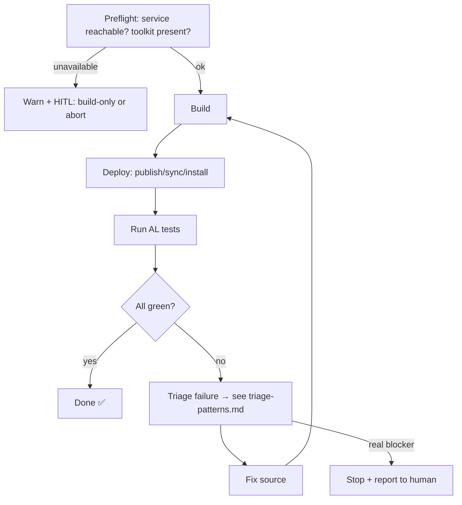

# Skill: Aproda Test-Loop (Build → Deploy → Run → Review)

> **Aproda custom skill** — part of the Aproda ALDC layer. See [`../../readme.aproda.md`](../../readme.aproda.md) and [`../../decisions.aproda.md`](../../decisions.aproda.md).
> **Status: VALIDATED.** The engine runs the full build → deploy → materialize-runner → run → parse cycle end-to-end against the live BC 28 OnPrem service (27/27 green on the Audit Trail extension). The falsifiable lessons below are proven by failing-then-passing tests.

## Purpose

Validate an AL extension end-to-end against a **live BC OnPrem service**: build the app(s), deploy (publish/sync/install), run the AL test runner, review results, and **loop** (fix → deploy → run → review) until all tests pass or a genuine blocker is hit.

## When to Load

Load this skill when:
- An implementation is finished and needs runtime verification before PR (LOW complexity → once, before PR).
- A conductor phase reaches its quality gate (MEDIUM/HIGH → at each phase boundary).
- Tests are failing and need the structured Fix → Deploy → Run → Review loop.
- Build/deploy against the OnPrem server needs to be (re)run.

> Trigger policy is bound to the **existing LOW / MEDIUM-HIGH** complexity tiers — not a new heuristic. See [Workflow](#workflow).

## The Loop (state machine)

**Loop discipline:** loop until all tests pass **or** a real blocker (service down, spec contradiction). **Do not** brute-force the same strategy repeatedly — if a fix doesn't move the result, escalate.

## Preflight gate (HITL)

- **Once per spec, before the first publish**, ask the user which environment to use, sourced from `launch.json` configurations (server/instance/tenant per `configuration`). Selection, not free-text.
- Record the choice + acknowledgement (session memory / phase report) → the loop then runs autonomously for that spec (no re-prompt per iteration).
- Only `server`-type (OnPrem/shared) configs require the acknowledgement; a local Cronus sandbox may be auto-allowed.
- **Service unavailable** → warn, differentiated: (a) no service reachable, (b) service up but **no Test Toolkit / no test environment**. Allow **build-only** (static validation via `alc.exe` + Dredd/BCQuality) with an explicit HITL acknowledgement; never hard-block. Warn **once per spec**, not per iteration.

  > Suggested wording: *"No BC service reachable. Quality is higher with a Cronus BC environment incl. Test Toolkit. Without a service only static validation (build + audit) is possible, no runtime verification. Proceed build-only?"*

## Workflow

### LOW complexity (direct `@AL Implementation Specialist`)
Run the loop **once**, after implementation, before PR. No phases to gate.

### MEDIUM / HIGH complexity (`@AL Development Conductor`, TDD phases)
Run the loop at **each phase boundary** as the quality gate. The conductor already cuts the code into phases (`phase-N-complete.md`) — the loop **attaches to those existing boundaries**; a phase is "complete" only when its loop is green.

## References (load on demand)

- [`references/build-deploy.md`](references/build-deploy.md) — version-dynamic build, Base→Test symbol copy, deploy order, install-or-upgrade fallback.
- [`references/runner.md`](references/runner.md) — web-client ServiceUrl, runner DLLs materialized from the K: BC DVD, central version-agnostic glue, **SRP content-based script loading**, result parsing.
- [`references/triage-patterns.md`](references/triage-patterns.md) — the falsifiable failure→cause→fix patterns (the gold).

## Scripts (reusable engine — `scripts/`)

The skill ships an **immutable, parameter-driven engine** so the agent never rebuilds the loop from scratch — it only supplies a tiny per-project config.

- [`scripts/AprodaTestLoop.psm1`](scripts/AprodaTestLoop.psm1) — engine. Key functions: `Resolve-TestLoopConfig` (also resolves central `glueDir` + the K: DVD source), `Invoke-TestLoopBuild`, `Invoke-TestLoopDeploy`, `Resolve-TestLoopClientSource` (derives the runner DLL source from the BC DVD), `Initialize-TestLoopRunner` (idempotently materializes the 4 client DLLs), `Invoke-TestLoopRun`, `Get-TestLoopSummary`, `Invoke-AprodaTestLoop`. **Never edit per project.**
- [`scripts/Invoke-AprodaTestLoop.ps1`](scripts/Invoke-AprodaTestLoop.ps1) — thin entry (run via `Get-Content … -Raw | iex`). Loads the engine **content-based** (`[ScriptBlock]::Create`) because SRP blocks path-based execution.
- [`scripts/runner-glue/`](scripts/runner-glue/) — the 3 **version-agnostic** glue scripts (`ClientContext.ps1`, `PsTestFunctions.ps1` — MS canonical; `AprodaRunner.ps1` — Aproda wrapper). Central, shared by all projects/versions; never copied into `_runner/`.
- [`scripts/testloop.config.template.jsonc`](scripts/testloop.config.template.jsonc) — **copy** to `<project>/testloop.config.jsonc`. Fill apps in dependency order, runner dir, `companyName`, server-side Mgmt DLL, and the runner-DLL source: preferably `bcDvdRoot` + `bcCountry` (K: BC DVD), else `runnerClientSource`. The rest auto-derives from `launch.json` + each `app.json`.
- [`scripts/README.md`](scripts/README.md) — full usage + what auto-derives + the **New project / repo bootstrap** checklist.

**First run in a NEW project/repo** → follow [`scripts/README.md` → *New project / repo bootstrap*](scripts/README.md): (1) ensure `.vscode/launch.json` has a `server` config, (2) ensure the runner-DLL source is reachable (`bcDvdRoot`+`bcCountry` or `runnerClientSource`), (3) copy the config template + fill the few non-derivable values, (4) add `**/PowerShell/_runner/` and `**/PowerShell/_temp/` to `.gitignore`, (5) run the entry point — the **first run materializes** `_runner/<ver>/` from the DVD (later runs reuse it). **Subsequent runs** are just the entry point.

Mini-effort per project: copy the config, fill a few values, run the entry point. The 4 version-pinned client DLLs are **materialized on demand** from the K: BC DVD (`<bcDvdRoot>\<major>\<bcCountry>.<major>.<minor>\Applications\TestFramework\TestRunner\Internal`); the whole `_runner/` folder is git-ignored. Results: `<runnerDir>/<version>/TestResults.xml` (XUnit-style) → `Get-TestLoopSummary` returns pass/fail counts + failed names.

> **SRP**: this estate blocks path-based PowerShell execution (Group Policy) — engine and glue are always loaded **content-based** via `[ScriptBlock]::Create((Get-Content -Raw))`. See `references/runner.md`. Canonical infra facts (SRP, K: DVD, NST servers, remote-PS): [`../../site-profile.aproda.md`](../../site-profile.aproda.md).

> The proven origin scripts (`Test/PowerShell/_Cycle.ps1`, `_RunTests.ps1`) stay project-local as the validated reference; the engine is their generalized, parameterized form (Aproda decision D-8).

## Constraints

- This skill owns the **process** (how/when to loop). Generic, citable BC truths (e.g. xRec semantics) belong in **BCQuality** (`custom/knowledge/...`) and are **linked, not duplicated**, from `references/triage-patterns.md`.
- Does **not** cover writing tests (→ `skill-testing`) or root-cause debugging strategy (→ al-developer / skill-debug). It orchestrates them.
- Deploy writes to a **shared OnPrem server** → the preflight HITL gate is mandatory (operational safety).
